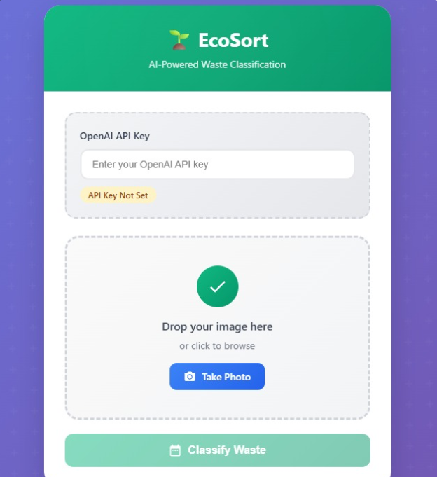

# ♻️ EcoSort – AI-Powered Smart Waste Classifier

EcoSort is an **AI-powered web app** that helps users identify and classify different types of waste through **ChatGPT API integration**.  
By uploading or taking a photo of an item, EcoSort uses AI to detect its **waste category** (plastic, paper, metal, glass, organic, or electronic) and provides clear **disposal or recycling guidance**.  
Additionally, the app calculates an **estimated carbon footprint** for the item, helping users understand the environmental impact of their choices.

---

## 📸 Demo Preview

---

## ❓ The Problem
Waste mismanagement is a major global issue:  
- Over **2 billion tons of waste** are generated every year, much of it ending up in landfills or oceans.  
- Many people are unsure how to properly **separate waste**, leading to **contamination of recycling streams**.  
- The **environmental impact of waste** (such as CO₂ emissions from production and disposal) is often invisible to individuals.  

This results in:  
- Reduced recycling efficiency.  
- Higher greenhouse gas emissions.  
- Increased landfill waste and pollution.  

---

## 💡 Our Solution
EcoSort provides an **accessible, AI-powered tool** for waste classification:  
- **Simple & Fast**: Just upload or snap a photo of an item.  
- **Accurate Sorting**: AI recognizes the correct waste category.  
- **Actionable Guidance**: Clear instructions on how to recycle or dispose properly.  
- **Awareness Building**: Shows the estimated **carbon footprint** of each item, connecting personal actions with climate impact.  

By making waste sorting **smarter and easier**, EcoSort encourages responsible consumption and sustainable urban living.  

---

## 🚀 Features
- 📸 **AI Image Recognition (via ChatGPT API)** – Classify waste instantly.  
- 🗑 **Smart Categorization** – Supports plastic, paper, metal, glass, organic, and electronic waste.  
- 🌍 **Carbon Footprint Estimation** – Approximate CO₂ impact for each item.  
- ✅ **Recycling & Disposal Guidance** – Tips for eco-friendly handling.  
- 📱 **Responsive UI** – Works on desktop and mobile.  

---

## 🌱 Example Workflow
1. User uploads a **metal soda can**.  
2. EcoSort sends the image + query to the **ChatGPT API**.  
3. The response includes:  
   - Classification: **Metal Waste**  
   - Estimated footprint: **~3.00 kg CO₂**  
   - Guidance: *Recycle in a metal bin. Metals can be recycled indefinitely without quality loss.*  
4. The UI displays the result in a clean, friendly format.  

---

## 🎯 UN Sustainable Development Goals (SDGs) Impact
EcoSort contributes to multiple UN SDGs:

- **SDG 12 – Responsible Consumption and Production**  
  Encourages proper waste management, recycling, and awareness.  

- **SDG 13 – Climate Action**  
  Displays waste carbon footprint to support climate-conscious decisions.  

- **SDG 11 – Sustainable Cities and Communities (Optional but Relevant)**  
  Promotes cleaner waste systems and sustainable urban living.  

---

## 🛠️ Tech Stack
- **Frontend**:  
  - HTML, CSS, JavaScript  
- **AI Integration**:  
  - **OpenAI ChatGPT API** (image + text classification)  
- **Hosting**:  
  - Netlify  

---

## 🔮 Future Improvements
- 📊 **Data Analytics Dashboard** – Track waste statistics for households and communities.  
- 🤖 **Custom AI Model Training** – Improve classification accuracy with localized datasets.  
- 🌍 **Expanded Categories** – Include hazardous waste, textiles, and medical waste.  
- 🔗 **Integration with City Systems** – Connect with municipal recycling and waste services.  
- 🎮 **Gamification** – Rewards and achievements to encourage consistent waste sorting.  

---

## 👥 Team 0404
EcoSort was proudly built by **Team 0404**:  
- 🧑‍💻 **Owen** – Frontend & AI Integration  
- 🎨 **Leonard** – UI/UX Design & Branding  
- ⚙️ **Dave** – API Handling  
- 📊 **Jomax** – UI/UX Design

---

## 📂 Project Links
- 🎥 **Presentation Video**: [Watch Here](https://drive.google.com/file/d/16wHYhyTR3qC_f-AhIB2Wi-RvcX7w2ym8/view)  
- 📑 **Pitch Deck / Presentation**: [View Here](https://www.canva.com/design/DAG0chYJrXs/UciAz-zw6tb0JXNTmP73HQ/edit)  
- 📹 **Demo Video**: [Watch Here](https://drive.google.com/file/d/1KPQZHrGqdajC6FA7-exM3sDbYwI3gJea/view?usp=sharing )  
- 🌐 **Live Demo**: [Try EcoSort](https://sweet-marigold-f6d112.netlify.app/)  
